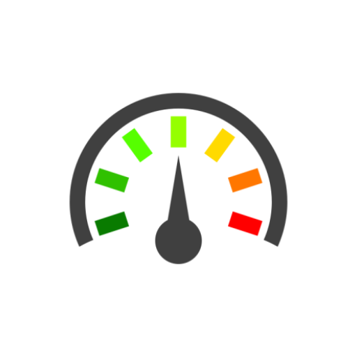

# BMI Calculator ⚖

  

A basic BMI Calculator built in Flutter as part of instructing CSI TKMCE Flutter Workshop.

## Description
BMI Calculator helps you calculate your BMI and lets you know your health status using BMI chart.
BMI Calculator follows a standard procedure for calculating your BMI from your height, weight and gender. 
Stay updated about your BMI to keep fit and avoid risking diseases.

## Features
- Standard and accepted calculation formula
- Simple UI and UX
- Self awareness

## Screenshots
  

## Download
Download here 👇

https://www.amazon.com/gp/product/B093T9W9CZ

### Stay fit and healthy! 💪
